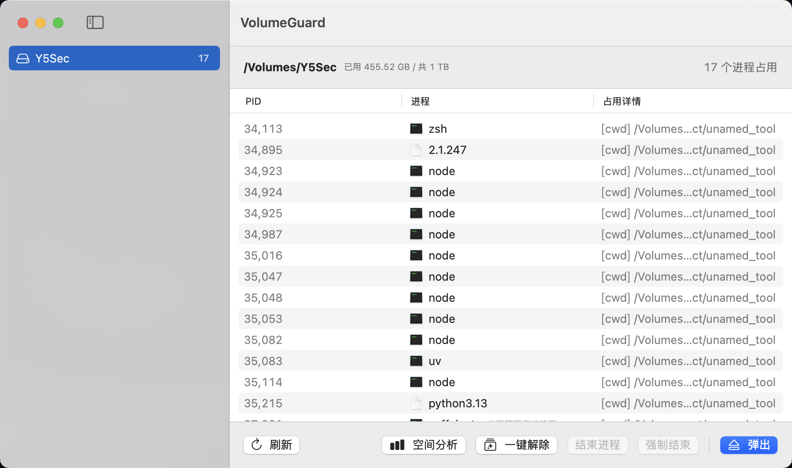

# VolumeGuard

<p align="center">
  
</p>

**Find what is blocking your external drive, kill it, eject.**

Native macOS tool that enumerates every process holding your disk open — files, working directories — and releases them in one click. Pure Swift + SwiftUI, zero third-party dependencies, ~350 KB installed.



## Why This Is Different

Most "eject" utilities just shell out to `lsof` and make you fight the list yourself. VolumeGuard speaks to the kernel directly:

- **libproc, not lsof** — `proc_pidfdinfo(PROC_PIDFDVNODEPATHINFO)` per descriptor, full scan in ~30 ms
- **Working directories count** — a terminal `cd`'d into the volume blocks eject too; most tools miss this
- **Two-phase release** — SIGTERM everyone, rescan, auto-escalate survivors to SIGKILL. Root processes are reported, not silently skipped
- **Occupier classification** — Spotlight indexing, QuickLook thumbnails, Time Machine, iCloud sync get labeled with what they actually are
- **Menu bar resident** — tray icon switches to a warning glyph the moment any volume becomes busy; release and eject without opening the window
- **No Xcode required** — builds with Command Line Tools alone via SPM

## How It Works

1. Enumerate every PID with `proc_listallpids`
2. Per PID, list open descriptors via `PROC_PIDLISTFDS`, filter vnode types
3. Resolve each descriptor path with `proc_pidfdinfo(PROC_PIDFDVNODEPATHINFO)` — fd-level flavor, must go through `proc_pidfdinfo`, not `proc_pidinfo`
4. Match paths against the volume mount point; also check `PROC_PIDVNODEPATHINFO` for cwd/root dirs
5. Release: SIGTERM all holders → rescan at +800 ms → SIGKILL whoever is still holding
6. Eject: `diskutil eject` (Finder's own primitive) — busy dissents come back with the offending PID

## Usage

Launch the app, pick a volume on the left, kill or release on the right. Double-click a row for full detail.

Tray: click the drive icon — per-volume occupancy with inline release/eject.

CLI:

```
volumeguard                     # scan all local volumes
volumeguard /Volumes/Y5Sec      # scan one volume
volumeguard --eject /Volumes/X  # eject
```

### Example

```
$ volumeguard /Volumes/Y5Sec
== /Volumes/Y5Sec ==
PID     进程         UID   占用
19724   node         501   [fd] /Volumes/Y5Sec/Projects/foo.dat
19908   node         501   [cwd] /Volumes/Y5Sec/Projects
共 2 个进程占用
```

```
$ volumeguard --eject /Volumes/Y5Sec
弹出失败: Unmount of disk7 failed: at least one volume could not be unmounted
Unmount was dissented by PID 39140 (/usr/bin/python3)
```

## Build

macOS 13+, Xcode Command Line Tools only:

```bash
./scripts/make_app.sh
open build/VolumeGuard.app
```

The script builds with SPM, assembles the bundle, generates the icon, ad-hoc signs.

## License

[MIT](LICENSE)
